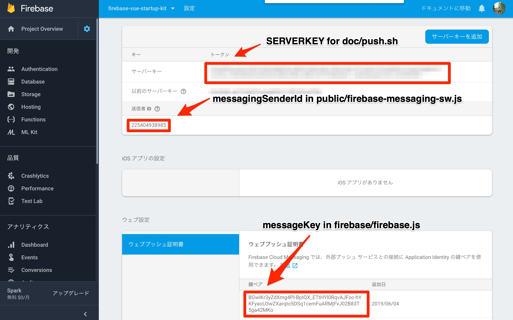
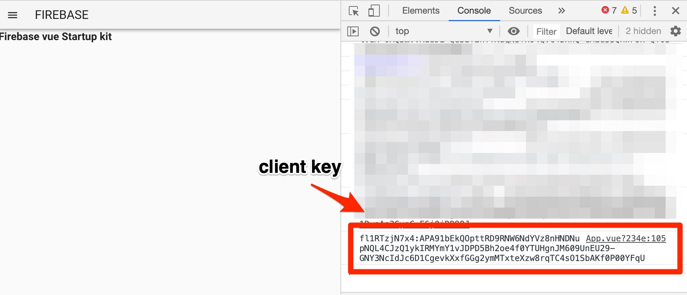
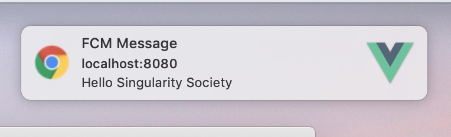

# 設定



### messagingSenderId

firebaseのコンソールから送信者ID(Sender ID)を取得、
public/firebase-messaging-sw.js のmessagingSenderIdを設定するに設定
（公開してよいID)

### messageKey

firebaseのコンソールで、web pushの証明書を追加し、公開鍵を設定取得して
src/firebase/firebase.jsのmessageKeyに設定
(公開しても良い鍵)

### server key
firebaseのコンソールでサーバーキーを取得。メモしておく。設定する必要はない。pushを送るときに使う。
これは公開しては駄目なキー。

### client key
デプロイして、ブラウザでアクセスする。
設定が成功していれば、通知許可するか聞かれるので許可する。
ブラウザのデバッグコンソールでclient keyを確認してコピー。メモる。
(公開しないほうがよいkey)



# push

doc/以下で以下のコマンドでpushする

```
SERVERKEY="{server_key}" CLIENTKEY="{client_key}" bash push.sh
```

成功していれば通知が届く




